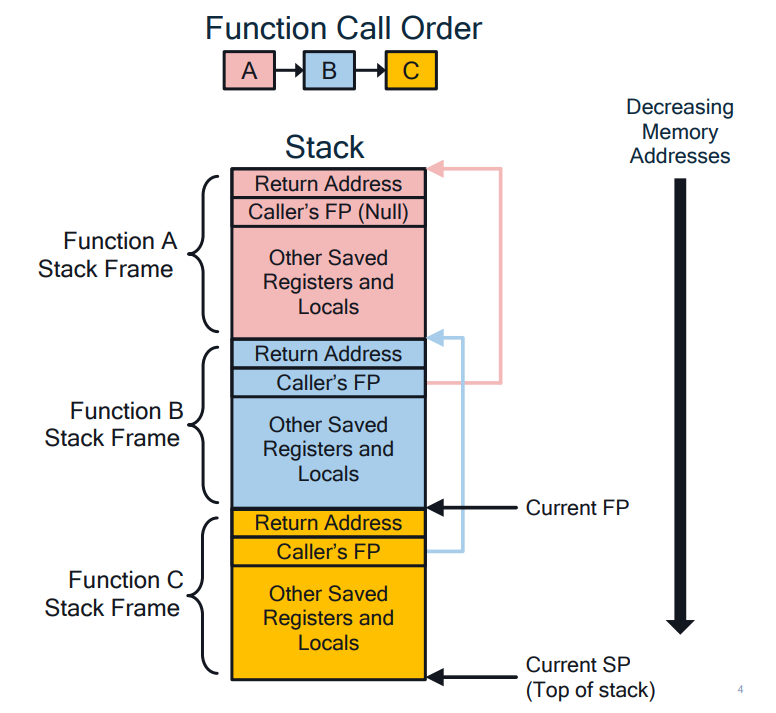
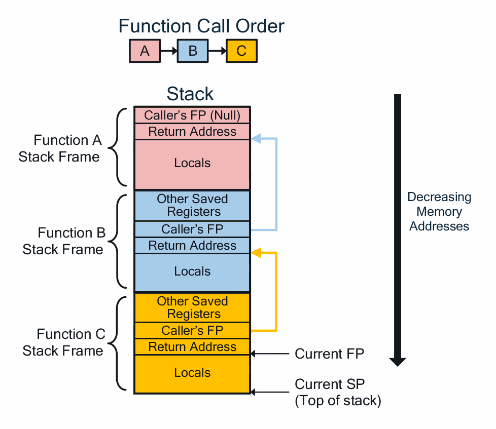
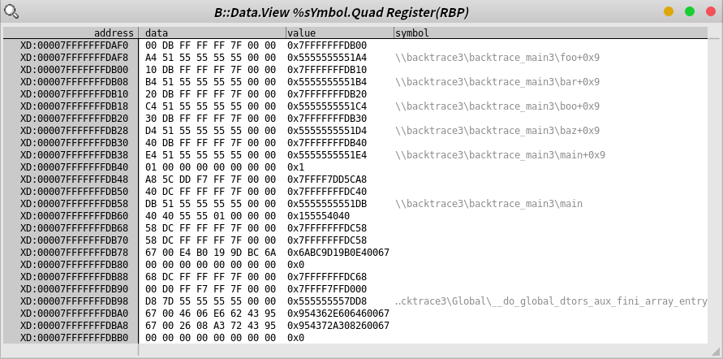
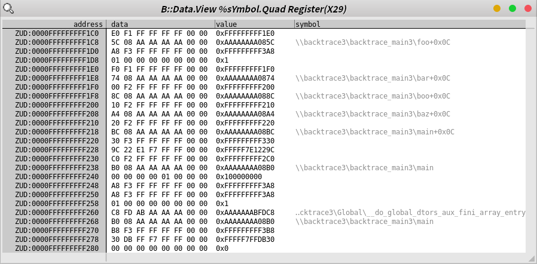
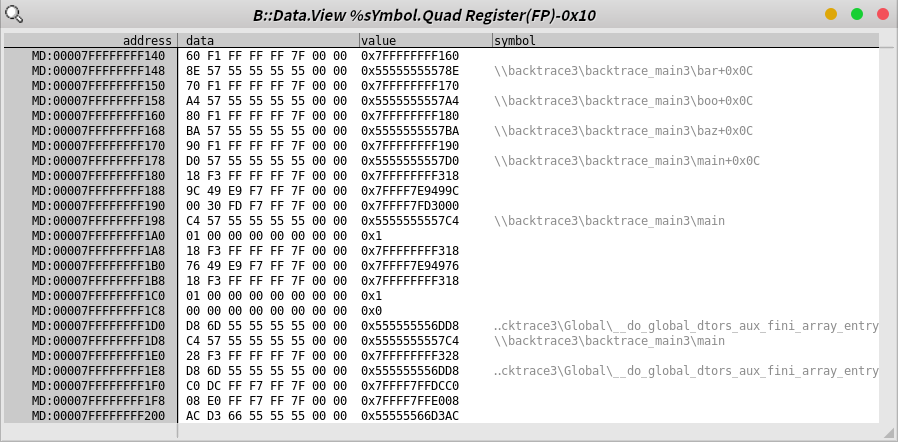

## 7. BACKTRACE 구현

### Backtrace 구현 3
- 원래 강의에서는 `getFP()` 라는 함수를 만들어서 하는데, 이게 컴파일러와 컴파일 옵션에 영향을 받는다.

```c
void **getFP(int dummy)
{
    void **fp = (void**)(&dummy + 5) ;
    return fp;
}
```

- Stack Frame의 구조를 이해하는 것이 목적이므로 `-fno-omit-frame-pointer` 컴파일 옵션을 사용해 **프레임 포인터** 를 사용하게 하고, 인라인 어셈블리로 **프레임 포인터** 를 직접 읽어 온다.

```c
    struct frame *frame;
    __asm__ volatile("mov     %%rbp,%0" : "=r"(frame));
```

- riscv의 Stack Frame은 다른 아키텍쳐와 구조가 다르다.
  - 그림 출처: https://github.com/riscv-non-isa/riscv-elf-psabi-doc/issues/437

```c
struct frame {
    struct frame *fp;
    void *ip;
};
```

|x86_64 and aarch64|riscv64|
|-|-|
|`FP`가 `struct frame` 의 **시작 주소** 가리킨다.|`FP`가 `struct frame` **시작 주소 + `sizeof(struct frame)`** 을 가리킨다.|
|||

- 이러한 차이점으로, **프레이 포인터** 를 따라가는 Backtrace는 아래처럼 구현이 달라지게 된다.
  - riscv 의 경우 `1-object-offset)`을 빼준다.
<table>
<tr>
<td>
<b>x86_64</b>
</td>
<td>

```c
    __asm__ volatile("mov     %%rbp,%0" : "=r"(frame));

    while (frame < frame->fp && frame->ip > (void *)&__executable_start) {
        frame = frame->fp;
    }
```
</td>
</tr>
<tr>
<td>
<b>aarch64</b>
</td>
<td>

```c
    __asm__ volatile("mov     %0,fp" : "=r"(frame));

    while (frame < frame->fp && frame->ip > (void *)&__executable_start) {
        frame = frame->fp;
    }
```
</td>
</tr>
<tr>
<td>
<b>riscv64</b>
</td>
<td>

```c
    __asm__ volatile("mv      %0,fp" : "=r"(frame));
    frame -= 1;

    while (frame < frame->fp && frame->ip > (void *)&__executable_start) {
        frame = frame->fp - 1;    /* NOTE: */
    }
```
</td>
</tr>
</table>

#### x86_64


#### aarch64


#### riscv64

